# orion-waveshare-rotary-dial

> **Not affiliated with, endorsed by, or supported by Orion Sleep or Waveshare.**
> This is an independent, community-built project.

Turn a knob to change the temperature of your side of the bed. This project
turns a **Waveshare ESP32-S3 round touch-LCD knob** into a standalone bedside
dial for an **[Orion Sleep](https://orionsleep.com) dual-zone mattress
topper** — no phone app, no hub on your network, no cloud service to run
yourself. The dial talks to Orion directly, over Wi-Fi you already have.

<p align="center">
  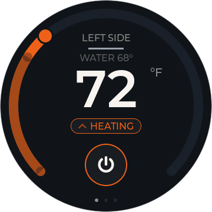
  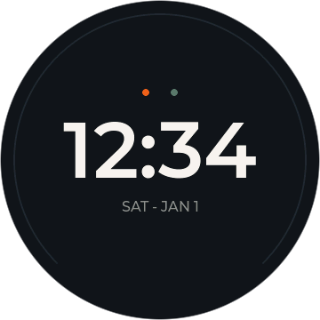
</p>

<!-- TODO: photo of the flashed dial on a nightstand -->

## Hardware required

- **Waveshare ESP32-S3-Knob-Touch-LCD-1.8** — the round 1.8" touch-LCD knob
  board (ESP32-S3, rotary encoder + capacitive touch + haptics). See
  [firmware/README.md](firmware/README.md) for the full parts table.
  Sold by Waveshare here:
  [waveshare.com/esp32-s3-knob-touch-lcd-1.8](https://www.waveshare.com/esp32-s3-knob-touch-lcd-1.8.htm?sku=34875)
  — a third-party store with no connection to this project, linked purely for
  convenience. Verified to point at the right board on 2026-08-03; product
  pages move and SKUs get retired, so check the specs on arrival rather than
  trusting the link.
- An Orion Sleep dual-zone topper on the same 2.4 GHz Wi-Fi network, and an
  Orion account.

One dial covers one side of the bed; run two if you want independent control
of both zones.

## Quick start

### ⚡ Flash from your browser (recommended)

**Open [chris023.github.io/orion-waveshare-rotary-dial](https://chris023.github.io/orion-waveshare-rotary-dial/)
in Chrome or Edge, plug the dial in over USB-C, and click Install.**
That's the whole install — no toolchain, no downloads. Everything else
(Wi-Fi setup, pairing your Orion account, choosing a side) happens on the
dial's own screen, and future updates arrive over the air.

> No port showing up in the picker? Rotate the connector 180° in the
> dial's own socket — same cable end, just upside down; the board reaches
> a different chip in each orientation.

<details>
<summary><sub>Build from source (developers)</sub></summary>

```bash
cd firmware/dial-idf
idf.py set-target esp32s3
idf.py build
idf.py -p <PORT> flash
```

Needs **ESP-IDF v6.0** installed first. Full build/flash instructions,
board bring-up notes, and firmware architecture live in
[firmware/dial-idf/README.md](firmware/dial-idf/README.md).

</details>

## Features

- **On-device setup** — Wi-Fi and Orion pairing both happen right on the
  dial. No app, no computer, no config file.
- **Scan-and-approve Orion pairing** — a QR code opens Orion's consent page
  in your phone's browser; the dial registers itself as an OAuth client on
  the spot (Dynamic Client Registration) — no shared secret baked into the
  firmware.
- **Dual-zone control** with a side picker, so one dial can drive either
  half of the bed — plus screen rotation, so the same board reads right
  from either nightstand.
- **Absolute or relative temperature** — read the setpoint as a real
  temperature (**°F or °C**, your choice) or as an Orion-style **−10…+10
  level**, switchable in settings. Fresh dials default to relative.
- **Schedule or hold** — a change made on the dial can either ride your
  Orion schedule (the next scheduled step still happens, matching what the
  app does) or hold for the rest of the night. A status chip on the dial
  face says which is in effect, and when it runs out.
- **Boost heat or cool** from the icons at either end of the temperature
  arc — a timed push in one direction that returns you to where you were.
- **Quiet knob, honest haptics** — the encoder's own mechanical detents are
  the feedback when you turn it; the motor only fires where it tells you
  something the clicks can't, like hitting the end of a range. Strength is
  configurable (Off / Low / High / Auto, dimmer at night).
- **Day/night palette** that shifts with your sleep schedule, and a **standby
  clock face** for when it's idle — with separate brightness for the day, the
  night, and the clock itself, plus a configurable screen timeout.
- **OTA updates** straight from this repo's GitHub Releases, with bootloader
  rollback if one goes bad, an optional beta channel, and auto-update that
  installs in the quiet hours after you wake — never while you're asleep.
- **Away mode**, **re-link**, and a tap-twice **factory reset** in settings,
  for when you travel, the pairing goes stale, or you want to start clean.

## Screens

<table>
<tr>
<td align="center"></td>
<td align="center">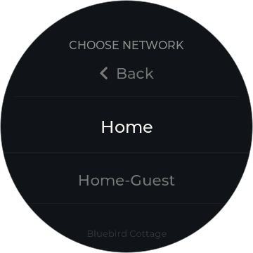</td>
<td align="center"></td>
<td align="center">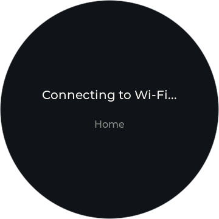</td>
</tr>
<tr>
<td align="center">First boot</td>
<td align="center">Join Wi-Fi</td>
<td align="center">Type a password</td>
<td align="center">Connecting</td>
</tr>
<tr>
<td align="center">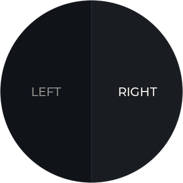</td>
<td align="center"></td>
<td align="center">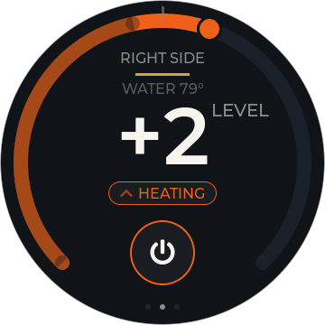</td>
<td align="center">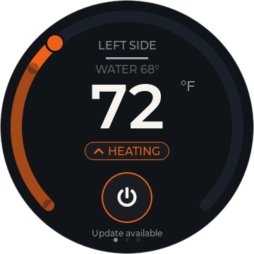</td>
</tr>
<tr>
<td align="center">Pick your side</td>
<td align="center">The dial</td>
<td align="center">Relative scale</td>
<td align="center">Update available</td>
</tr>
<tr>
<td align="center">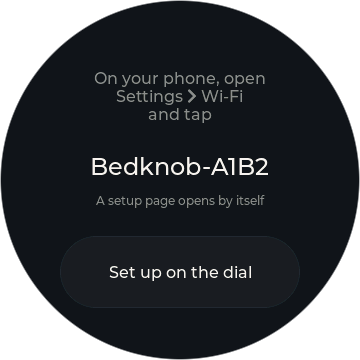</td>
<td align="center">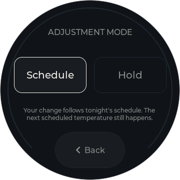</td>
<td align="center">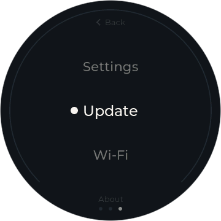</td>
<td align="center">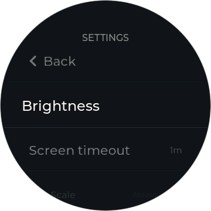</td>
</tr>
<tr>
<td align="center">Wi-Fi setup</td>
<td align="center">Adjustment mode</td>
<td align="center">Menu</td>
<td align="center">Settings</td>
</tr>
<tr>
<td align="center">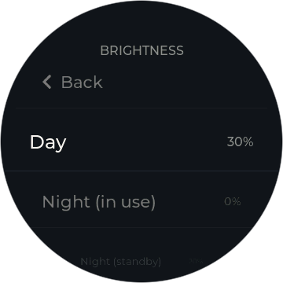</td>
<td align="center"></td>
<td align="center">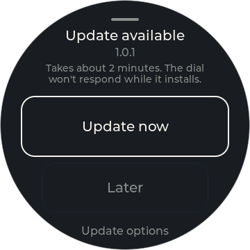</td>
<td align="center">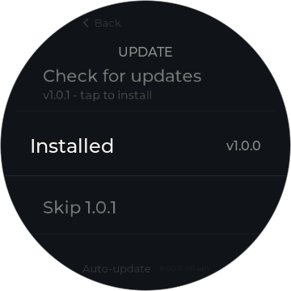</td>
</tr>
<tr>
<td align="center">Brightness</td>
<td align="center">Setting a level</td>
<td align="center">Update prompt</td>
<td align="center">Update options</td>
</tr>
<tr>
<td align="center"></td>
<td align="center"></td>
<td align="center">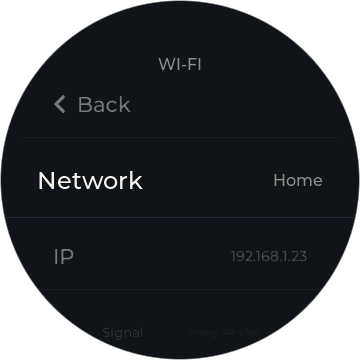</td>
<td align="center">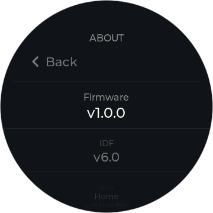</td>
</tr>
<tr>
<td align="center">Standby clock</td>
<td align="center">Installing</td>
<td align="center">Wi-Fi details</td>
<td align="center">About</td>
</tr>
</table>

The rest — the standby face carrying an update hint, the night-clock
brightness picker — are in [`docs/screens/`](docs/screens/).

### Preview the UI without hardware

Every screenshot above is a pixel-exact render of the real firmware UI,
produced by the simulator in [`simulator/`](simulator/) — no board required:

```bash
cmake -B build -S simulator
cmake --build build
```

Then run `./build/dial_sim` from the repo root; PNGs land in
`docs/screens/`. See
[simulator/README.md](simulator/README.md) for details.

## What's new

[CHANGELOG.md](CHANGELOG.md) covers every release; the same notes appear on
each [GitHub Release](https://github.com/chris023/orion-waveshare-rotary-dial/releases).

## Repo layout

- [`firmware/dial-idf/`](firmware/dial-idf/) — the product: the ESP-IDF (C)
  firmware that actually ships.
- Earlier prototypes (a TypeScript/Node hub, a Moddable display attempt,
  hardware bring-up probes) have been removed from the tree; they're
  preserved in this repo's git history, not needed to build or run the dial.

## License

[PolyForm Noncommercial 1.0.0](LICENSE) © 2026 Chris Meyer. Free to use,
build, modify, and share for **personal and other noncommercial
purposes**. Any commercial use — selling devices or software built on
this project, or using it in or for a business — requires a separate
commercial license: open a GitHub issue to ask. Third-party components
used by the firmware are under their own licenses — see
[THIRD_PARTY_LICENSES.md](THIRD_PARTY_LICENSES.md).

## Contributing

Contributions are welcome. By submitting one you agree it's licensed to
the project maintainer under terms that let the project be licensed as
above, including commercially.
