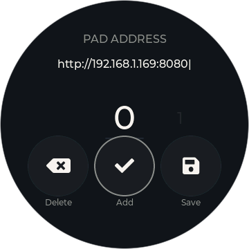
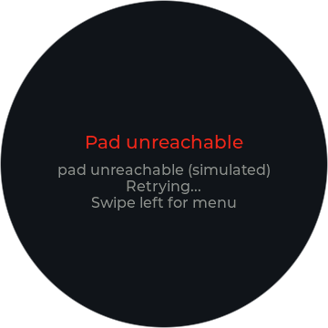
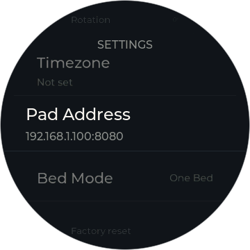

# Bedknob for Somnus

> **Not affiliated with, endorsed by, or supported by Somnus Lab or Waveshare.**
> An independent, community-built project. Current release
> `somnus-v1.0.0`.

Turn a knob to change the temperature of your bed. This project turns a
**Waveshare ESP32-S3 round touch-LCD knob** into a standalone bedside dial
for a **Somnus Pad** (the thermoelectric, water-circulating mattress pad from
Somnus Lab) — no phone app to unlock, no hub, no cloud account. The dial
talks to the pad directly over the Wi-Fi you already have, using the pad's
own local HTTP API.

<p align="center">
  
  
</p>

Bedknob is a fork of **[Orion Dial](https://github.com/chris023/orion-waveshare-rotary-dial)**
by Chris Meyer, which does the same job for an Orion Sleep topper through
Orion's cloud. This fork replaces the cloud pipeline with Somnus's local API
and keeps everything else that made the original good. See
[Relationship to Orion Dial](#relationship-to-orion-dial) and
[License](#license).

## What you need

- **Waveshare ESP32-S3-Knob-Touch-LCD-1.8** — the round 1.8" touch-LCD knob
  board (ESP32-S3, rotary encoder, capacitive touch, haptics, metal case).
  Waveshare's product page:
  [waveshare.com/esp32-s3-knob-touch-lcd-1.8](https://www.waveshare.com/esp32-s3-knob-touch-lcd-1.8.htm)
  — a third-party store with no connection to this project; check the specs
  on arrival rather than trusting the link. The SKU that ships with the
  battery installed is the one this firmware was developed on.
- **A USB-A to USB-C data cable** for the one-time flash. A C-to-C cable
  will not work with this board (it negotiates plug orientation itself,
  which defeats the board's two-chip USB switch), and a charge-only cable
  powers the board while enumerating nothing.
- **A Somnus Pad** on the same 2.4 GHz Wi-Fi network, with its **local API
  enabled**. No Somnus account is involved. If your pad does not answer on
  `http://<pad-ip>:8080/api/state`, the local API is off at the pad's
  firmware level — that is a question for Somnus, not something the dial
  can work around.

One dial does the whole job. In One Bed mode it controls the bed; in Dual
Sides mode it controls both sides — swipe between the LEFT SIDE and RIGHT
SIDE faces.

## Quick start

### Flash from your browser

**Open [matthewclaude.github.io/somnus-dial-releases](https://matthewclaude.github.io/somnus-dial-releases/)
in Chrome or Edge, plug the dial in with a USB-A to USB-C cable, and click
Install.** No toolchain, no downloads. Everything else — Wi-Fi, timezone,
finding your pad — happens on the dial's own screen, and future updates
arrive over the air.

Flashing from the browser writes the whole flash, so it **always erases** a
dial's settings (Wi-Fi, timezone, pad address). It is a first-install tool.
Over-the-air updates from the dial's Update menu keep your settings and are
the normal way to update.

> No port showing up in the picker? Rotate the connector 180° in the
> **dial's** socket — same cable end, upside down. The board reaches a
> different chip in each orientation; you want the one that shows up as
> ESP32-S3 or "USB JTAG/serial debug unit".

### First boot, on the dial

1. The dial starts a Wi-Fi hotspot. Join it from your phone; a setup page
   opens. Pick your network and enter the password.
2. The setup page passes your phone's timezone to the dial. If it can't
   (some phone browsers don't), the dial asks you to pick one from a short
   list the first time it reaches the pad.
3. The dial scans your network and finds the pad by itself. No IP to type.
   If it can't find one, Settings → Pad Address lets you enter it.
4. Settings → Bed Mode: **One Bed** or **Dual Sides**, matching the toggle
   in the Somnus app. The pad's API cannot report this, so the dial trusts
   you — and names the mode on the face (**BOTH SIDES**, **LEFT SIDE**,
   **RIGHT SIDE**) so a wrong setting is visible at a glance.

## What it does

- **Turn the knob, the bed changes.** One detent is one Somnus app level
  (1.0 °C). The setpoint reads either as a real temperature (**°F or °C**)
  or as the app's **−15…+15 level** — same numbers the app shows, so the
  dial and the app never disagree. Fresh dials default to the level scale.
- **Tracks the bed, not just itself.** A change made in the Somnus app, or
  by the pad's own overnight schedule, shows up on the dial within seconds.
  A **COOLING / HEATING / HOLDING** pill reports what the water is actually
  doing.
- **An off side is inert.** Turning the knob on a side you've switched off
  does nothing to the pad — the power button breathes twice to point you at
  what to press instead.
- **Finds the pad by itself**, and recovers by itself if the pad's address
  changes.
- **Honest haptics** — the encoder's own detents are the feedback; the motor
  only fires where the clicks can't tell you something, like the end of the
  range. Off / Low / High / Auto, quieter at night.
- **Day and night** — Settings → Night mode picks when the dial switches to
  its warm palette, dimmer backlight and softer haptics: 9 pm – 7 am, 10 pm
  – 6 am, or Off. Plus a **standby clock face** when idle, separate
  brightness for day, night and the clock, and a screen timeout. *(Night
  mode arrived in 0.1.5-beta.1 and shipped on the stable channel in 0.1.5.)*
- **Over-the-air updates** from this project's GitHub Releases, with
  bootloader rollback if an image fails to boot, an optional beta channel,
  and optional automatic installs in a two-hour window after night ends
  (9–11 am with the default window).
- **Escape hatches that work when you need them** — Change network, Check
  for updates and a tap-twice Factory reset are reachable and functional
  even while the dial can't reach the pad.

## What it doesn't do

The Somnus local API has exactly three endpoints (read state, set power,
set target temperature). So:

- **No schedules.** The dial cannot read, edit or create the pad's overnight
  schedule; it only sees the setpoint move. Schedules stay in the Somnus
  app.
- **No zone-mode detection.** See Bed Mode above.
- **No water-low or error display yet.** The pad reports both; the dial
  stores them but does not surface them in the UI.

A feature request for a zone-mode field and a schedule endpoint is on file
with Somnus.

## What it talks to

Your pad on the LAN, over plain HTTP. `pool.ntp.org` for the clock.
`api.github.com` and `objects.githubusercontent.com` for update checks and
downloads, which means GitHub sees the dial's public IP on each check.
Nothing else, no telemetry.

## Screens

Every image is a pixel-exact render of the real firmware UI from the
simulator in [`simulator/`](simulator/); the full set is in
[`docs/screens/`](docs/screens/).

<table>
<tr>
<td align="center"></td>
<td align="center"></td>
<td align="center"></td>
<td align="center"></td>
</tr>
<tr>
<td align="center">First boot</td>
<td align="center">Wi-Fi setup</td>
<td align="center">Pad address</td>
<td align="center">Looking for the pad</td>
</tr>
<tr>
<td align="center"></td>
<td align="center"></td>
<td align="center"></td>
<td align="center"></td>
</tr>
<tr>
<td align="center">The dial</td>
<td align="center">Level scale</td>
<td align="center">Update available</td>
<td align="center">Standby clock</td>
</tr>
<tr>
<td align="center"></td>
<td align="center"></td>
<td align="center"></td>
<td align="center"></td>
</tr>
<tr>
<td align="center">Menu</td>
<td align="center">Settings</td>
<td align="center">Update options</td>
<td align="center">About</td>
</tr>
</table>

### Preview the UI without hardware

```bash
cmake -B build -S simulator
cmake --build build
./build/dial_sim
```

PNGs land in `docs/screens/`. See [simulator/README.md](simulator/README.md).

## Build from source

Needs **ESP-IDF v6.0**. The tracked `sdkconfig.defaults` already carries the board configuration
(quad flash, octal PSRAM, 16 MB) — **do not run `idf.py set-target`**, it
regenerates `sdkconfig` from defaults and discards that configuration.

```bash
cd firmware/dial-idf
idf.py build
idf.py -p <PORT> flash monitor
```

A wire flash writes only the bootloader, partition table, OTA data and app,
so unlike the browser flasher it **preserves** settings. Board bring-up
notes, the partition layout and the firmware architecture are in
[firmware/dial-idf/README.md](firmware/dial-idf/README.md) and
[docs/ARCHITECTURE.md](docs/ARCHITECTURE.md).

## Releases

Firmware is published from this repository to
[matthewclaude/somnus-dial-releases](https://github.com/matthewclaude/somnus-dial-releases),
which also hosts the browser flasher. Each release carries `somnus-dial.bin`
(the OTA image the dial downloads) and `somnus-dial-merged.bin` (a full-flash
image for manual flashing from offset `0x0`). Tags are `somnus-vX.Y.Z`;
[CHANGELOG.md](CHANGELOG.md) is the source of every release's notes.

**1.0.0 shipped 2026-09-09** — the `0.1.6` build renumbered, once a
stranger could buy the board, flash it from the URL above and add their pad
without help, and the housekeeping this fork inherited was done. Everything
before it was a 0.x beta.

## Repo layout

- [`firmware/dial-idf/`](firmware/dial-idf/) — the ESP-IDF (C) firmware
  that ships. `components/dial_somnus/` is the pad client;
  `components/dial_pad_discovery/` finds the pad; the rest is display,
  input, state, OTA and UI.
- [`web-flasher/`](web-flasher/) — the browser flasher page and manifests,
  deployed to the releases repo by CI.
- [`simulator/`](simulator/) — headless desktop build of the UI for
  screenshots.
- [`docs/`](docs/) — design specs (`SPEC-*.md`), the architecture note, the
  screen renders. Specs are written before code and kept current with what
  actually shipped; each carries its status at the top.
- [`reference/local_api.yml`](reference/local_api.yml) — Somnus's published local API spec
  (v0.2.0), the only contract the firmware relies on.

## Related

Two macOS companions live in their own repositories: **Bedknob for Mac**, an
interactive preview of the dial that drives a real pad, and **Bedknob
Mini**, a read-only menu bar reader. Both are private for now.

## Relationship to Orion Dial

Everything about how this dial *feels* — the knob, the haptics, the palette
system, the standby clock, the OTA pipeline, the setup portal — is Chris
Meyer's work in Orion Dial, kept as intact as the port allowed. What changed
is the other end of the wire: Orion's OAuth login, its cloud MCP server and
the account-derived sleep schedule are gone, replaced by a local HTTP client
for three endpoints, a subnet scan to find the pad, and a user-set Bed Mode
where the cloud used to say which side was whose. Anything here that is
about the pad is new; anything about the dial is inherited.

Upstream is actively developed and this fork tracks it; useful upstream
fixes are ported when they apply.

## License

**Source-available, not open source.**
[PolyForm Noncommercial 1.0.0](LICENSE), inherited from Orion Dial and
passed through unchanged. Free to use, build, modify and share for
**personal and other noncommercial purposes**. This fork holds no rights
beyond that license and **cannot offer a commercial license** to anyone;
commercial use of the inherited code is a question for its author.

```
Required Notice: Copyright © 2026 Chris Meyer (https://github.com/chris023/orion-waveshare-rotary-dial)
```

Third-party components are under their own licenses — see
[THIRD_PARTY_LICENSES.md](THIRD_PARTY_LICENSES.md).

**Provided as is, without warranty.** You flash and use it at your own
risk. The pad clamps every setpoint to its own safe range regardless of
what a client asks for, and the Somnus app remains the authoritative
control for your bed.

## Contributing

Contributions are accepted under PolyForm Noncommercial 1.0.0, the same
terms as the rest of the code. There is no contributor agreement and no
assignment of rights — there is nothing this fork could do with them.
