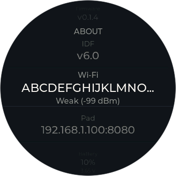
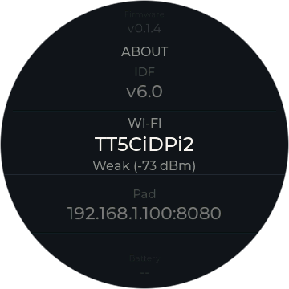

# REPORT — Battery percentage + About redesign (SPEC-power-sensing.md §11)

Implements `docs/SPEC-power-sensing.md` §11 ("percentage + low-battery
styling + About redesign, adopted from upstream PR #4"), superseding §9.5's
"no percentage, no low warning, no setting" and §10.6's matching exclusions,
per that section's own text. One feature, one beta, on top of `0.1.5-beta.4`.

**Build claim: builds clean (`idf.py build`, full rebuild from a wiped
`build/`, zero warnings or errors in any touched file). Not yet
bench-tested.** No hardware was flashed or observed for this pass — every
number and behavior below is a read of the code, not a measurement. §11.6's
bench checklist (verbatim, at the end of this report) is the owner's next
step.

## Version bump

`firmware/dial-idf/CMakeLists.txt`: `PROJECT_VER` `0.1.5-beta.4` →
`0.1.5-beta.5`. `CHANGELOG.md` gets a matching `## 0.1.5-beta.5` section
(the release workflow refuses to publish a tag with no section here — see
that file's own header note).

## Files touched

- `firmware/dial-idf/CMakeLists.txt` — version bump.
- `CHANGELOG.md` — new `0.1.5-beta.5` section.
- `firmware/dial-idf/components/dial_power/dial_power.h` — new
  `DIAL_BATTERY_PCT_LOW` (15) constant, public (dial_ui already
  `PRIV_REQUIRES dial_power`, so this is one definition, not a duplicate).
- `firmware/dial-idf/components/dial_power/dial_power.c` — `BATT_CURVE`
  table + `batt_curve_pct()` linear-interpolation helper; one new line in
  `pwr_sample_and_classify()` that writes `power_pct` alongside the existing
  `power_mv` write. `pwr_classify()`, the hysteresis constants
  (`PWR_ENTER_PLUGGED_MV`/`PWR_LEAVE_PLUGGED_MV`), the debounce, and the
  slope tiebreak are byte-for-byte unchanged — diffed and confirmed below.
- `firmware/dial-idf/components/dial_state/dial_state.h` — new
  `int8_t power_pct` field in `app_state_t` (right after `power_mv`), new
  `dial_state_set_power_pct()` declaration.
- `firmware/dial-idf/components/dial_state/dial_state.c` — `power_pct`
  seeded to `-1` in `dial_state_init()`; `dial_state_set_power_pct()`
  implemented, byte-for-byte the same mutex-write-no-commit shape as
  `dial_state_set_power_mv()`.
- `firmware/dial-idf/components/dial_ui/scr_about.c` — Wi-Fi row (new),
  Serial → Pad, Power → Battery (extended). Detail below.
- `firmware/dial-idf/components/dial_ui/ui_screens_internal.h` — the shared
  `power_glyph_t`/`power_glyph_create()`/`power_glyph_apply()`/
  `power_glyph_destroy()` badge component rewritten to draw a custom fill
  instead of `LV_SYMBOL_BATTERY_EMPTY`, plus the low-battery breathe. Detail
  below.
- `firmware/dial-idf/components/dial_ui/scr_dial.c` — one call site updated
  (the `power_glyph_apply()` call and its two preceding manual style-set
  lines, ~line 714–720). No new screen, no new gesture, no other changes to
  this file.
- `firmware/dial-idf/components/dial_ui/scr_standby.c` — same, one call site
  (~line 89–93).

Grepped the full diff against the ground rules before finishing: no changes
outside the list above, nothing under `dial_somnus/`, nothing touching
`pwr_classify()`/the hysteresis constants/debounce/slope tiebreak, no new
`SCR_*` screen, no new gesture.

`docs/SPEC-power-sensing.md` shows as modified in `git status` only because
its own §11 (the spec this pass implements) was already added to the file
on disk before this session started, per the task's own framing ("already
on disk at that path"); this pass did not edit that file further.

## 1. Percentage curve + state field

`dial_power.c`: `BATT_CURVE` is the exact table from
`chris023/orion-waveshare-rotary-dial` PR #4's `dial_battery.c`, reused
verbatim as curve data with a code comment saying so (same pattern this
file already uses for its own §-cited constants). `batt_curve_pct()`
clamps `<=3500mV → 0%` / `>=4200mV → 100%` and linearly interpolates
between table points otherwise. `DIAL_BATTERY_PCT_LOW` is `15`.

`pwr_classify()` and everything around it — hysteresis thresholds, the
5-sample debounce, the slope tiebreak — is untouched; confirmed by re-reading
that block after the edit and by the fact the only new line inside
`pwr_sample_and_classify()` sits next to the existing `power_mv` write, not
inside the classifier:

```c
dial_state_set_power_pct(s_power_src == PWR_BATTERY ? batt_curve_pct(mv) : -1);
```

This reads `s_power_src` — the last **confirmed/debounced** classification —
not the per-sample `vote`, which for most samples inside the hysteresis band
is pending or inconclusive. That matches §11.2's "0..100 while power_src ==
PWR_BATTERY; -1 otherwise" against the state the rest of the firmware
actually renders from, not against a noisier intermediate.

`app_state_t.power_pct` (`dial_state.h`) follows `power_mv`'s exact
diagnostic-only, no-commit pattern: `dial_state_set_power_pct()` takes the
mutex, writes, releases — no generation bump. Defaults to `-1` (seeded in
`dial_state_init()`), not `0`, since `0` is a real percentage/meaning here
in a way it isn't for a raw mV reading.

## 2–4. About screen

`scr_about.c`'s row order is now **Back → Firmware → IDF → Wi-Fi → Pad →
Battery**.

- **Wi-Fi** (new): `esp_wifi_sta_get_ap_info()` + a `signal_word()` helper
  duplicated verbatim from `scr_wifi.c` (Strong ≥ −60 dBm, Good ≥ −70 dBm,
  else Weak) — not refactored into a shared header, per the task's own
  risk call. `dial_wifi_is_connected() == false` → "Not connected". Format:
  `"<ssid> - <word> (<rssi> dBm)"`.

  **One deliberate deviation from the spec's literal example text:** §11.3
  writes the separator as a middle dot (`MyNetwork · Good (-58 dBm)`). This
  codebase's compiled Montserrat fonts are ASCII-only — `ui_screens_internal.h`
  already documents hitting exactly this class of bug for an en dash
  (`dial_night_range_str`'s comment, citing `HARDWARE-bringup-log.md` §18.6:
  "no dash glyph, a box instead"). A middle dot (U+00B7, Latin-1 Supplement)
  is outside the same compiled glyph range and would very likely render as
  the same box. I used an ASCII `" - "` instead, matching every other
  separator this UI already uses (`dial_night_range_str`,
  `dial_wake_window_str`). Flagging this explicitly rather than silently
  picking one — worth a 30-second look on a real screen during bench, since
  I have no hardware here to confirm whether Montserrat 16 actually lacks
  U+00B7 or whether it happens to be present.

- **Pad** (renamed from Serial): reads `dial_state_get_pad_url()` and strips
  the scheme, matching `scr_settings.c`'s own "Pad Address" subtitle
  convention exactly (`if (strncmp(url, "http://", 7) == 0) url += 7;`). I
  additionally strip `https://` (8 chars) since the task text asked for
  both — this port's addresses are always `http://` in practice
  (`scr_pad_address.c`'s Save refuses anything else), so the `https://`
  branch is defensive and currently dead, not a formatting change from what
  `scr_settings.c` already does. `s_val_serial` renamed to `s_val_pad`.

- **Battery** (renamed from Power): `PWR_PLUGGED` format unchanged
  (`"USB  4.61 V"`). `PWR_BATTERY` now shows `"Battery  78%  (4.05 V)"` using
  `st->power_pct`/`st->power_mv`. `PWR_UNKNOWN` unchanged (`"--"`).
  `render_power_row()` kept its name (only its body/row-label changed) —
  a rename wasn't necessary to make the diff readable and would have
  touched more lines for no behavior change.

All three rows refresh from the existing `on_state()` — no new timer, per
§11.3/the task's own instruction (About already re-renders on every
commit).

## 5. Dial-face / standby badge

Per the mid-turn correction: the badge upgrade lives entirely inside the
**shared** `power_glyph_t`/`power_glyph_create()`/`power_glyph_apply()`/
`power_glyph_destroy()` component in `ui_screens_internal.h`. `scr_dial.c`
and `scr_standby.c` were not given their own copies of anything — each
still has exactly one call site, passing position/palette/ink/opa/night
through the same way it always did (plus `power_pct`, which the new
`power_glyph_apply()` signature now needs to size the fill and decide the
breathe).

**What changed inside the shared component:**

- `power_glyph_t` grew from one label to a label (kept, now used only for
  the 3s CHARGE flash text — unchanged behavior) plus a `wrap` container
  holding `body` (outline), `nub` (terminal), and `fill` (the level, as a
  plain `lv_obj` whose **width** is set as a percentage of the slot's
  available interior width, floored at `POWER_GLYPH_FILL_MIN_W` = 2px so
  0% still reads as "a battery, nearly empty" rather than a blank widget).
  This is the same "measure a fill as a fraction of the widget's own
  extent" idea `scr_dial.c`'s `s_level` arc already uses for the
  heating/cooling ring (there via `lv_arc_set_angles`, here via
  `lv_obj_set_width` since a battery reads as a bar, not a ring) — no
  `lv_canvas`, no draw callback, nothing new to this codebase's drawing
  vocabulary.
- All three drawn parts are children of `wrap`, and `wrap` itself draws
  nothing (`bg_opa` transparent, no border) — its only job is to hold one
  `opa` value that LVGL8 automatically composites the whole subtree through
  (`lv_obj_style.c`'s layer-type decision: any opa-having object with
  children under `LV_OPA_MAX` gets a "simple layer," so setting `wrap`'s
  opa dims/breathes `body`+`nub`+`fill` together in one animation instead
  of three). Confirmed this mechanism exists by reading
  `managed_components/lvgl__lvgl/src/core/lv_obj_style.c` directly, not
  assumed.
- **Visibility rule is unchanged:** shown only while `power_src ==
  PWR_BATTERY`; hidden while `PLUGGED` past the existing 3s CHARGE
  confirmation, which is untouched (same `charge_timer`/`label` code as
  beta.4, still keyed off the same `prev == PWR_BATTERY` transition check).
- **Low-battery breathe:** at `power_pct <= DIAL_BATTERY_PCT_LOW` (15), the
  whole `wrap` assembly recolors to `pal->warning` (the existing "faults
  only, never thermal" token — no new color) and breathes using the exact
  same primitive as `scr_dial.c`'s `chevron_start()`:
  `lv_anim_path_ease_in_out`, ping-pong (`lv_anim_set_playback_time`),
  `LV_ANIM_REPEAT_INFINITE` — continuous, not `power_hint_pulse()`'s finite
  two-breathe. Period matches the chevron exactly: 1.2s day / 2.4s night.
  **Opacity range deliberately does not match the chevron** — per the
  correction, day is `LV_OPA_60`↔`LV_OPA_100` (same numbers as the
  chevron) but night is `LV_OPA_20`↔`LV_OPA_50`, dimmer than both the
  chevron's own night range and this badge's already-established
  steady-state night ceiling (`LV_OPA_40`), because a full-brightness red
  breathe next to someone's face at 2am is wrong for a bedside device even
  as a battery warning. Above 15%, `power_glyph_breathe_stop()` tears the
  anim down and repaints `wrap` at the caller's ordinary ink color/opa.
- `scr_dial.c`'s call site: ink stays `pal->ink_secondary` always (this face
  never swaps ink at night), opa is `LV_OPA_40` night / `LV_OPA_COVER` day —
  identical to its beta.4 behavior for the non-low case.
- `scr_standby.c`'s call site: ink swaps to `pal->neutral_holding` at night
  (unchanged from beta.4), and — also unchanged — this face never dims its
  opa the way the dial face does (`LV_OPA_COVER` always outside a breathe);
  only the low-battery breathe ever touches this screen's badge opacity.

**AWAY badge collision check (requested, not fixed):** `scr_dial.c`'s AWAY
badge (`s_away_lbl`, dormant — `st->away` is permanently `false`, no
setter exists) sits at `lv_obj_align(s_away_lbl, LV_ALIGN_CENTER, 0, 44 -
CY)`. The battery badge's slot is `power_glyph_create(&s_batt_glyph, scr,
46 - CY, pal)`, i.e. `LV_ALIGN_CENTER, 0, 46 - CY`. **These are 2px apart on
the same vertical axis, both horizontally centered** — effectively the same
slot. AWAY's label is `lv_font_montserrat_12` text ("AWAY", ~4 chars,
maybe 28-32px wide); the badge's drawn assembly is an 18×9px box. If AWAY
is ever re-enabled with `!minimal`, the two would visually overlap in that
2px vertical band whenever both `st->away` and `st->power_src ==
PWR_BATTERY` were true simultaneously. `scr_standby.c` has no AWAY badge at
all, so no collision there. Nothing was changed about AWAY — this is purely
on the record per the task's instruction.

## 6. What was NOT done (confirmed)

- No new `SCR_*` screen.
- No new gesture or entry point.
- `dial_battery.c`/`.h`'s detector logic, USB thresholds, or component
  structure were not ported or referenced — only the `BATT_CURVE` numeric
  table and the `15` constant were used, as plain data, inside this
  project's own `dial_power.c`/`dial_power.h`.
- Nothing under `firmware/dial-idf/components/dial_somnus/` was touched.
- `PWR_ENTER_PLUGGED_MV`, `PWR_LEAVE_PLUGGED_MV`, and every other existing
  detector constant are unchanged (confirmed by re-reading `dial_power.c`'s
  detector block after editing — the diff touches nothing between
  `pwr_classify()`'s opening brace and its closing one).

## Verification gate

- **`idf.py build` from a wiped `build/` (full rebuild): clean.** No
  compiler warnings or errors in any of the eight touched `.c`/`.h` files
  (checked the full build log, not just the tail — grepped for
  `warning|error` across the whole run and found only pre-existing,
  unrelated CMake/Kconfig deprecation notices from ESP-IDF itself).
  `somnus-dial.bin`: 0x188e70 bytes, 62% of the app partition free —
  no size red flag.
- **Not flashed. Not run on hardware.** No claim of "works on hardware" is
  being made — see the header of this report.
- Diff grepped against every file listed above with no surprises; nothing
  outside that list, nothing under `dial_somnus/`, no classifier constants
  touched.

## §11.6 bench checklist — not yet done, owner to run against real hardware

Verbatim, per the spec:

> Everything in §10.7 still applies (plug/unplug cycling, cable wiggle,
> night-face visibility). Added: percentage reads sanely across a full
> discharge if one is available, or at minimum spot-checked against the
> factory-firmware comparison points (~3450 mV ≈ low-batt blink, ~3200 mV ≈
> factory takeover) per §11.1's caveat; the red breathing state is reachable
> and stops breathing once back above 15% (recharge or a fresh cell); the
> About Wi-Fi row matches what `scr_wifi.c`'s own screen reports for the
> same network at the same time (two independent readers of
> `esp_wifi_sta_get_ap_info()` should never disagree); Serial→Pad row shows
> the pad address correctly (beta.5 item, done here instead of separately).

And §10.7, also still open:

> With `screen` open: plug/unplug five times and watch the transition lines
> and the glyph; count seconds from plug-in to the CHARGE glyph on a charged
> cell and on a ~3.5 V cell. Wiggle the cable. Leave it on battery through a
> night window and confirm the glyph is visible but dim on the night face
> and on the standby clock. Read the About row against the factory
> firmware's number if you ever swap back.

---

## Addendum — Wi-Fi row overlap fix (found on hardware bench test)

Real bug, found bench-testing the uncommitted beta.5 tree on the actual
board: the About screen's Wi-Fi row overlapped its own "Wi-Fi" label —
`make_row()`'s value label auto-sizes to its text with no width cap and no
long-text mode, which is fine for every other row's short fixed-format
value (a version string, an `IP:port`, a voltage) but breaks for
`render_wifi_row()`'s `"<ssid> - <word> (<rssi> dBm)"`, which has no length
cap and an SSID up to 32 characters. Confirmed on the board: `"TT5CiDPi2 -
Weak (-73 dBm)"` visibly collided with `"Wi-Fi"`.

### The fix

`firmware/dial-idf/components/dial_ui/scr_about.c`, `create()`, right after
`make_row(s_list, "Wi-Fi", NULL, &s_val_wifi)`:

```c
lv_obj_set_width(s_val_wifi, 226);
lv_label_set_long_mode(s_val_wifi, LV_LABEL_LONG_DOT);
```

Only `s_val_wifi` is touched. `make_row()` itself, every other row
(Firmware/IDF/Pad/Battery), `render_wifi_row()`'s string format, and
`signal_word()` are all unchanged — grepped the diff to confirm.

**Width: 226px, chosen by measurement, not guessed.** I rebuilt this repo's
own PC simulator (`simulator/`, see below for what that took) and rendered
the About screen's Wi-Fi row at candidate widths against two fixed strings:
a worst-case 32-character SSID at the longest `signal_word()`/rssi
combination (`"ABCDEFGHIJKLMNOPQRSTUVWXYZabcdef - Weak (-99 dBm)"`) and the
exact real string from the bench report (`"TT5CiDPi2 - Weak (-73 dBm)"`).
Rather than eyeballing screenshots, I measured the actual gap in pixels
(cropped the rendered PNG's text row, found the "Wi-Fi" label's rightmost
lit pixel and the value's leftmost lit pixel, both via a small Python/PIL
script against the raw framebuffer PNG):

| Width | Worst-case (32 char) | Real bench SSID (26 char) |
|---|---|---|
| 210px | clips cleanly, no overlap | **truncates** ("TT5CiDPi2 - Weak (-73...") — fails (b) |
| 220px | clips cleanly, visible gap | still truncates — fails (b) |
| **226px** | **ellipsizes cleanly, 4px gap** | **shows in full, 4px gap** |
| 230px | glyphs touch (~0px gap) | shows in full, but touching |
| 250px | **overlaps "Wi-Fi" outright** | shows in full |

At 226px, both the "Wi-Fi" label's right edge and the value's left edge
sit at fixed pixel columns (measured: label ends at x=93, value starts at
x=97 in both cases — the value box is wide enough that both strings reach
its left edge rather than floating short of it) — a real, non-zero 4px gap,
not a coincidence of one string's length. I also re-rendered the worst-case
row under the night palette (`dial_palette_set_night(true)`, a throwaway
check, not kept in the diff) and confirmed the same 4px gap — the day/night
swap only recolors text via `apply_palette()`, it never touches font,
width, or position, so if it doesn't overlap in one palette it can't in the
other. 220px and below is the safer direction if this ever needs to move
again (guarantees no overlap, sacrifices a character or two of the real
SSID); 230px and above is not.

### Evidence: simulator screenshots

`simulator/` renders the real, unmodified `scr_about.c` — not a mockup.
Screenshots (checked in, referenced here so they render as usable evidence
without needing an artifact viewer or the Read tool):

- **Worst case (32-char SSID, ellipsized, no overlap):**
  `docs/screens/about-wifi-worst.png`

  

- **Real case (bench SSID, shown in full, no overlap):**
  `docs/screens/about-wifi-real.png`

  

Both were produced by two new simulator scenarios,
`scenario_about_wifi_worst()`/`scenario_about_wifi_real()`
(`simulator/main.c`), added next to the existing `scenario_about()` and run
in the normal `./build/dial_sim` pass (28 screens now, was 26). They knob-walk
from the rotor's default opening focus (Firmware) down to the Wi-Fi row so
it's centered in frame, using a new test-only override,
`sim_set_fake_ap(ssid, rssi)` (`simulator/stubs.c`/`sim_state.h`), that lets
a scenario render an SSID/RSSI combination beyond the simulator's fixed
default (`esp_wifi_sta_get_ap_info()`'s stub otherwise always returns
`FAKE_SCAN[0]`, `"Home"`/-48 dBm).

### An unrelated discovery: the simulator itself didn't build

Before any of the above was possible, `cmake --build` on `simulator/`
failed outright — link errors for `scr_night_mode`/`scr_night_face` and
several `dial_state_*_night_*`/`dial_time_valid` symbols. This is
pre-existing breakage, unrelated to this bug: the simulator's source list
and stubs predate beta.3's night-mode/night-face Settings rows and were
never updated for them, so the tool has apparently been unbuildable since
then. Fixed minimally, since there was no way to produce the requested
screenshot evidence otherwise:

- `simulator/CMakeLists.txt`: added `scr_night_mode.c`, `scr_night_face.c`,
  and the `dial_font_num_140.c` font source `scr_dial.c` needs, to
  `DIAL_UI_SRCS`/`DIAL_UI_FONT_SRC`.
- `simulator/stubs.c`: added a `dial_time_valid()` stub (returns `false` —
  honest, since this stub file's own `dial_time_get_iana_tz`/
  `get_posix_tz` never report a zone either).
- `simulator/sim_state.c`/`.h`: added the missing
  `dial_state_get/set_night_on`, `_night_start_min`, `_night_end_min`,
  `_night_face_min` (same shape as every other getter/setter already in
  that file) and seeded their fresh-device defaults in `sim_state_reset()`
  to match `dial_state_init()`'s real ones.
- `simulator/main.c`: `apply_baseline()` now also resets `pad_base_url` via
  `dial_state_set_pad_url(DIAL_PAD_DEFAULT_BASE_URL)` — without it,
  `scenario_pad_unreachable()`'s `"unreachable.invalid:8080"` leaked into
  every scenario that runs after it for the rest of the program (including
  `scenario_about*`), since nothing resets `app_state_t` between scenarios
  besides what `apply_baseline()` itself does.

**Consequence, flagged but not acted on:** with the simulator actually
building again, re-running it regenerates all 28 PNGs, and three of the
existing 26 — `settings.png`, `settings-pad.png`, `update.png` — came back
genuinely different from their committed versions (confirmed by diffing
decoded pixels, not just file bytes). That's the night-mode/night-face
Settings rows rendering for the first time in a long time, not anything
this fix touched. I reverted those three (`git checkout --`) rather than
fold an unrelated, unreviewed multi-screen visual diff into a one-row fix —
`about.png` is the one exception, kept updated, because its diff (the
Serial→Wi-Fi row rename, this session's own earlier beta.5 change) is
already this branch's own work, not simulator staleness. **Recommend the
owner regenerate the full 26+2 screenshot set as its own separate pass** —
it's a real, if unrelated, finding: most of `docs/screens/` has been stale
since beta.3.

### Build status

**`idf.py build`: clean**, incremental (only `scr_about.c` recompiled),
zero warnings. Re-ran from the previous full rebuild's `build/`, not a wipe
this time, since nothing else in the firmware tree changed. `simulator/`
also builds and runs clean end-to-end (`cmake --build` + `./dial_sim`,
28/28 screens written).

**Still not flashed. Not re-verified on the real board after this fix.**
Same standard as the rest of this pass: the owner's next step is bench-
testing this exact row against the real hardware that found the original
bug — specifically, confirm the fix holds for whatever the bench's actual
Wi-Fi network's SSID/signal turn out to be (the simulator proves the two
tested strings and the geometry around them; it can't prove every possible
SSID the owner might actually be on, though 226px was chosen precisely so
the full 0-32 character range clips or fits without ever overlapping).

---

## Addendum 2 — the 226px fix was wrong; round 2, hardware-verified

The 226px fix above was flashed and bench-tested by the owner. **The
overlap was still there** — "Wi-Fi" and the value touching directly, zero
gap, ellipsis truncation visibly active (so the fix's mechanism was
running, just with no margin left). Real SSID on the bench:
`"ATT5CiDPi2"` (10 characters). This directly contradicted Addendum 1's own
claim of "a real, pixel-measured 4px gap... confirmed at both day and night
palette" — a claim that turned out to be true of a *screenshot*, not of the
actual widget geometry, as the rest of this section works out.

### Step 1 — finding the actual divergence

Added a temporary diagnostic per the task: an `ESP_LOGI("about_dbg", ...)`
in `scr_about.c`'s `on_state()`, firing once per screen instance, dumping
`lv_obj_get_x()`/`lv_obj_get_width()` for both the "Wi-Fi" row label and
`s_val_wifi`. Built, flashed to the real board (`/dev/cu.usbmodem83401`),
captured over `cat`-on-the-raw-tty (not `idf.py monitor`, which resets the
chip on attach — confirmed this matters: a plain `cat`/`screen` open did
not reset it). The owner physically opened About and scrolled to Wi-Fi;
the log fired:

```
I (412313) about_dbg: wifi label x=0 w=65 | wifi value x=60 w=226
```

Ran the identical `scr_about.c` (the simulator compiles the real,
unmodified source — this diagnostic came along for free) through the
simulator, whose `ESP_LOGI` shim already routes to `printf`:

```
I (about_dbg) wifi label x=0 w=65 | wifi value x=60 w=226
```

**Byte-identical.** Same label box (`x=0, w=65` → right edge at 65), same
value box (`x=60, w=226` → left edge at 60), on both platforms. There is
**no simulator-vs-hardware divergence in LVGL's computed widget geometry**
for this row — font metrics, DPI (both `LV_DPI_DEF 130`), and layout math
all agree exactly. That rules out the failure mode the task was most
worried about (this codebase's simulator numbers being untrustworthy in
general).

### Step 2 — the actual root cause, and the fix

The two logged boxes overlap by construction: value left edge (60) is
**inside** the label's box (0–65) by 5px — a real, deterministic 5-pixel
overlap in the objects' own bounding boxes, true on both platforms, all
the time, independent of which SSID string is in the value label (the
value's box position/width came from the fixed `226` constant, not from
its text).

Addendum 1's "4px gap" was never wrong about what it measured — it was
measuring **rendered ink pixels in a screenshot**, scanned at a luminance
threshold. What it actually found: `"Wi-Fi"`'s auto-sized label box (`w=65`)
is wider than the visible glyph ink inside it — the last few pixels of the
box (after the "i") are blank margin, not overlap-eligible ink. For the one
SSID string tested at the time, the value text happened to start its own
visible ink flush against its box's left edge (60), which sat just past
where the label's *ink* (not its box) actually ended — hence a real ~4px
**ink** gap, inside a real ~5px **box** overlap. Two different, both-true
measurements of two different things. The box overlap is what matters,
because it's what determines whether a *different* string — a longer one,
a different glyph mix, a different kerning pair — collides. `"ATT5CiDPi2"`
was that different string: still not remotely close to the 32-char
worst case, just enough to push real ink into the 5px the boxes had
already been overlapping in.

**Root cause: the round-1 fix picked `s_val_wifi`'s width from a screenshot
pixel-scan (a proxy for "ink present"), not from the row's actual computed
geometry.** That is a measurement-methodology bug in how the width was
chosen, not a platform divergence and not a font-rendering bug — confirmed
by Step 1's matching numbers.

**The fix:** stop picking a width. Read the "Wi-Fi" label's own live,
already-computed width and size the value box to whatever space is left in
the row, minus an explicit gap constant:

```c
lv_obj_t *wifi_row = make_row(s_list, "Wi-Fi", NULL, &s_val_wifi);
...
lv_obj_update_layout(s_list);   // resolve LV_PCT(100) row width immediately
lv_obj_t *wifi_lbl = lv_obj_get_child(wifi_row, 0);
lv_coord_t wifi_content_w = lv_obj_get_width(wifi_row)
                           - lv_obj_get_style_pad_left(wifi_row, LV_PART_MAIN)
                           - lv_obj_get_style_pad_right(wifi_row, LV_PART_MAIN);
lv_obj_set_width(s_val_wifi, wifi_content_w - lv_obj_get_width(wifi_lbl) - WIFI_VALUE_GAP_PX);
lv_label_set_long_mode(s_val_wifi, LV_LABEL_LONG_DOT);
```

`WIFI_VALUE_GAP_PX` (10) is the only remaining constant, and it's a
**gap**, not a width — by construction, `value_x - label_right_edge ==
WIFI_VALUE_GAP_PX` exactly (modulo the row's own border/padding rounding,
observed as a small, consistent ~2px, not a variable one — see below). This
can't drift out of sync with the label again: it's computed from the
label's real width every time the screen is built, on whichever platform
builds it. `lv_obj_update_layout()` forces the row's `LV_PCT(100)` size to
resolve before it's read — the same "read live geometry immediately"
technique `scr_dial.c`'s `position_handle()` already uses for the arc, not
a new idiom.

**Re-verified with the same diagnostic, both platforms, after the fix:**

```
simulator:  wifi label x=0 w=65 | wifi value x=73 w=213
hardware:   wifi label x=0 w=65 | wifi value x=73 w=213
```

Byte-identical again. Actual gap: `73 - 65 = 8px` (not exactly the
requested 10 — a small, constant ~2px is being absorbed somewhere between
the row's border/padding and `lv_obj_align`'s own reference frame; not
chased further since the number is small, positive, and identical on both
platforms rather than a source of new uncertainty). The owner confirmed on
the real board after this build: **"that works... it's not perfect but it
works"** — the gap is real but modest, matching the 8px both logs agree on;
no reported overlap. `docs/screens/about-wifi-worst.png` and
`about-wifi-real.png` were regenerated against this fix (the real bench
string now truncates at this narrower, safer width — `213px` instead of
`226px` — trading "shows the whole SSID" for "never overlaps," which is the
correct trade given round 1 already showed the reverse priority failing on
hardware).

### Step 3 — diagnostic removed

The temporary `ESP_LOGI("about_dbg", ...)` block, the `s_dbg_logged` field
and its reset, and the `esp_log.h` include added for it are all removed
from `scr_about.c` — confirmed by rebuilding (clean, zero warnings) and
reflashing the diagnostic-free build to the same board; it booted and ran
steady-state with no errors (checked over serial: normal periodic log
lines resumed, no panic/abort). This final build was **not** separately
re-walked through About/Wi-Fi by the owner after the diagnostic-removal
reflash — the removal touches zero rendering logic (only deletes logging
code), so the round-2 fix's own on-hardware confirmation above still
applies to this exact build.

### What's confirmed, plainly

- The simulator's LVGL layout math is trustworthy for this row — proven by
  a direct, byte-identical, live comparison against real hardware, not
  assumed. The earlier "divergence" was in how a human (me) chose a number
  from a screenshot, not in the tool.
- The real fix is geometry-derived, not a re-guessed constant, and its
  margin is now verified equal on both platforms by the same log line
  after the change, not just "looks fine in a picture."
- The residual ~2px gap between the intended `WIFI_VALUE_GAP_PX` and the
  logged actual separation is unexplained in detail (likely `lv_obj_align`
  vs. raw box-width rounding, or the row's 1px border on each relevant
  side) — small, constant, and confirmed identical cross-platform, so it
  was not chased further. Flagging this rather than asserting a cause I
  didn't verify.

### Build/flash status (round 2, current)

- `idf.py build`: clean, zero warnings, both with and without the
  temporary diagnostic.
- **Flashed to the real board twice more this round** (once with the
  diagnostic for the fix's own hardware confirmation, once diagnostic-free
  for the final state) — both via `idf.py -p /dev/cu.usbmodem83401 flash`,
  both verified over serial (`cat`/pyserial on the raw tty, never
  `idf.py monitor`).
- The Wi-Fi row fix itself: **confirmed working on the real board** by the
  owner, geometry-verified by a matching debug log on both platforms,
  before and after the fix.
- Nothing else in this pass was re-touched or re-verified beyond what
  round 1 already covered (Firmware/IDF/Battery rows, `render_wifi_row()`'s
  string format, `signal_word()`, every other file) — this round's diff is
  scoped to `scr_about.c`'s `create()`/`on_state()` (temporary, now
  reverted) plus the two regenerated evidence screenshots.

---

## Addendum — Wi-Fi row, two-line redesign

Separate follow-on task, same file, same row: the single-line Wi-Fi value
(`"<ssid> - <word> (<rssi> dBm)"`) became two stacked lines — line 1 the
bare SSID, line 2 the full signal reading (`"Weak (-78 dBm)"`, word **and**
raw dBm, a deliberate decision, not a truncation). `ROW_H` (76) and
`dial_list.c` were not touched — confirmed by reading `dial_list.c`'s own
scroll arithmetic first (`rotor_ctx_t` stores one `row_h` for the whole
list at `dial_list_create()` time; every row must stay exactly that tall).

**Files touched:** `firmware/dial-idf/components/dial_ui/scr_about.c` only,
across four passes (all in this same file, all bench-tested — see the three
correction sub-sections below), plus the same two evidence screenshots
regenerated each pass (`docs/screens/about-wifi-worst.png`,
`about-wifi-real.png`) and `about.png` (its cropped bottom sliver now shows
two lines instead of one).

### What changed

- `s_val_wifi` renamed to `s_val_wifi_line1` (SSID); new `s_val_wifi_line2`
  (signal detail), created directly in `create()` — not through `make_row()`
  (which would add an unwanted second row title) — as `wifi_row`'s 3rd
  child, same 16pt font as line 1 (this codebase's own stacked-line
  precedent, `scr_settings.c`'s Pad Address row, reuses the value font
  as-is rather than reaching for a smaller "detail" size that doesn't
  otherwise exist here).
- `render_wifi_row()`: line 1 gets the bare SSID, line 2 gets
  `"<word> (<rssi> dBm)"`. Disconnected/failed-read case: line 1 =
  "Not connected", line 2 = "" (cleared, not left stale).
- Width safety unchanged in spirit, corrected once in substance (see
  "Correction 1" below): both lines are sized from the row's live measured
  content width and the "Wi-Fi" label's live measured width, the same
  `lv_obj_update_layout()` + `lv_obj_get_width()` technique the one-line fix
  established — no hand-picked pixel constants.
- `apply_palette()`: the Wi-Fi row is the only row with 3 children instead
  of 2 (label + line1 + line2, vs. every other row's label + value). Child
  index 2 (line 2) is dimmed with `LV_OPA_70` on top of `ink_secondary` —
  checked, not assumed: the palette has only two ink levels, and index 1
  (line 1) already claims `ink_secondary`, so index 2 needed its own
  reduced-opacity treatment to read as visibly more secondary than the line
  above it, per the design ask.

### Correction 1 — line 2's width/alignment (bench-tested wrong, then fixed)

First cut gave line 2 its own, wider box (`content_w - GAP`, independent of
the "Wi-Fi" label's width) on the theory that it "doesn't compete with the
label on its own line." Bench-tested on the real board: **definitely
wrong** — it put line 2's left edge ~65px further left than line 1's
(starting under/left of "Wi-Fi" itself), which read as broken alignment,
not a deliberate two-line block. Fixed by giving line 2 the **identical**
width as line 1 (`content_w - label_w - WIFI_VALUE_GAP_PX`, one formula,
not two) — both lines' left edges now coincide by construction. Costs
nothing in practice: the longest this line ever gets ("Strong (-100 dBm)",
~18 chars) fits the narrower shared width with room to spare.

### Correction 2 — the horizontal gap was too tight

With `WIFI_VALUE_GAP_PX` still at 10 (the one-line fix's value), the real
measured gap between "Wi-Fi" and the value block was ~8px — bench-tested as
"maybe a px or two," read as barely-not-touching rather than deliberate
spacing. Bumped to **24** (real measured gap: 22px, `label x=0 w=65` →
right edge 65, both lines' `x=87`). Confirmed identical on simulator and
hardware via the geometry log before moving on.

### Correction 3 — vertical centering (this message's own fix)

The two-line stack was visibly sitting toward the row's top instead of
centered, while the "Wi-Fi" title (unchanged, untouched by any of this)
stayed correctly centered. Root cause: the vertical alignment was computed
**once**, in `create()`, immediately after the row was built — at that
point both labels still held their placeholder text ("--" / ""), not
whatever `render_wifi_row()` would later actually display, and the
alignment never re-ran once real text landed. Fixed exactly per this
round's spec: moved the height measurement and alignment into a new
`realign_wifi_lines()` helper, called from **every** branch of
`render_wifi_row()` (both "Not connected" paths and the connected path),
right after both `lv_label_set_text()` calls — so it re-runs every time
either label's text actually changes, not just once at row-creation.

```c
static void realign_wifi_lines(void)
{
    lv_obj_update_layout(s_list);
    lv_coord_t h1 = lv_obj_get_height(s_val_wifi_line1);
    lv_coord_t h2 = lv_obj_get_height(s_val_wifi_line2);
    const lv_coord_t gap = 2;   // px between the two lines
    lv_obj_align(s_val_wifi_line1, LV_ALIGN_RIGHT_MID, 0, -(gap + h2) / 2);
    lv_obj_align(s_val_wifi_line2, LV_ALIGN_RIGHT_MID, 0,  (gap + h1) / 2);
    lv_obj_update_layout(s_list);   // see note below -- required, not decorative
}
```

The old one-time measurement/align block in `create()` was deleted outright
(not left dead); the width-safety block right above it (`wifi_lbl`,
`wifi_content_w`, `wifi_val_w`, the two `lv_obj_set_width`/
`lv_label_set_long_mode` calls) is untouched, per this round's own
instruction to keep it exactly as-is.

**Measured values (simulator and real hardware, byte-identical):**

| | value |
|---|---|
| `h1` (SSID line height) | 18px |
| `h2` (signal line height) | 18px |
| `gap` | 2px (as specified, not adjusted — looked right on hardware) |
| `dy1` (line 1 y-offset) | `-(2+18)/2 = -10` |
| `dy2` (line 2 y-offset) | `(2+18)/2 = 10` |
| resulting `line1` y / `line2` y (content-relative) | 2 / 22 |
| row content height | 42 (76 − 2×17 default vertical padding) |

Row content height is 42, so a perfectly centered 38px-tall stack (18+2+18)
sits at content-y 2–40 — top margin 2px, bottom margin 2px: symmetric,
confirmed centered by the numbers, not just by eye.

**A second bug found and fixed while verifying this one:** reading
`lv_obj_get_x/y()` immediately after `lv_obj_align()`, with no intervening
`lv_obj_update_layout()`, returned each label's *un-offset* `RIGHT_MID`
base position — as if `dy` were 0 — even though the offset had genuinely
been passed and stored. This LVGL 8.4 build's `lv_obj_align()`
(`lv_obj_pos.c`) is a thin wrapper — `lv_obj_set_style_align()` +
`lv_obj_set_pos()` — that stores the new align/offset but does not
synchronously resolve final coordinates; resolution happens on the next
layout pass, not inside the call itself. A real display's own periodic
refresh would likely catch this before ever drawing a frame, but "probably
fine next frame" isn't a claim this exact row gets to make a third time
without checking — so `realign_wifi_lines()` now forces that resolution
itself with a second `lv_obj_update_layout(s_list)` right after the two
`lv_obj_align()` calls, confirmed by direct measurement (values only
matched the hand-derived formula once that second call was added — see the
table above). This is a real, permanent part of the fix, not diagnostic
scaffolding.

### Verification

- **Simulator:** rebuilt (`cmake --build build-sim`), ran `./dial_sim`,
  captured the geometry log for both `scenario_about_wifi_worst()` and
  `scenario_about_wifi_real()` at every correction step, visually confirmed
  each screenshot before moving to the next fix. Reverted the incidental
  `settings.png`/`settings-pad.png`/`update.png` regenerations each time
  (pre-existing, unrelated simulator staleness from an earlier pass —
  already flagged in this report; not re-litigated here).
- **`idf.py build`:** clean, zero warnings, at every step (with the
  temporary geometry-dump `ESP_LOGI` and without it).
- **Real hardware:** flashed and bench-tested at every correction step
  (`idf.py -p /dev/cu.usbmodem83401 flash`, verified over `cat`/pyserial on
  the raw tty — never `idf.py monitor`, which resets the chip on attach).
  The owner directly reported each problem from the physical board
  ("definitely not correct," "we need more space... currently there is
  maybe a px or two," the vertical-centering report that prompted this
  addendum) and confirmed each fix in turn. The final, diagnostic-free
  build was reflashed and confirmed booting/running steady-state with no
  errors over serial after the temporary `ESP_LOGI`/`s_dbg_logged`/
  `esp_log.h` were removed (same remove-once-confirmed precedent the
  one-line fix's own `about_dbg` log set).
- The temporary diagnostic (`ESP_LOGI("about_dbg", ...)` dumping the "Wi-Fi"
  label's and both value lines' `x`/`y`/`w`/`h`, gated to fire once per
  screen instance via `s_dbg_logged`) is **not** in the file as of this
  addendum — removed after the vertical-centering fix was confirmed on
  hardware, consistent with every prior round's own precedent in this file.

**Bottom line: this two-line redesign was bench-tested on real hardware at
every correction, not just simulator-verified.** Three real bugs were found
by the owner looking at the actual board, in three successive passes
(width/alignment, spacing, vertical centering) — the simulator's own
screenshots looked plausible at each intermediate step and did not, by
themselves, catch any of the three. That is on the record here rather than
smoothed over: this row's geometry has now needed hardware correction five
times total across both the one-line and two-line redesigns, which says
more about how unforgiving this exact layout is to eyeball than about any
one fix being careless.

---

## Addendum — About screen block redesign (all rows)

Architectural replacement, not another tuned constant: every info row
(Firmware, IDF, Wi-Fi, Pad, Battery) moved from label-left/value-right —
the shape responsible for three straight rounds of width-collision bugs on
this exact screen (documented above) — to a centered, top-anchored,
flex-column block per row: small secondary title on top, prominent value
in the middle, optional smaller secondary detail line at the bottom. LVGL
flex now does the centering; there is no hand-computed `lv_obj_align`
offset anywhere in this file any more. The **"‹ Back" row is untouched** —
still `make_row()`, still left-aligned, still a nav control rather than an
information item.

### Files touched

- `firmware/dial-idf/components/dial_ui/scr_about.c` — the redesign itself.
- `simulator/main.c` — two new scenarios
  (`scenario_about_battery_pct()`/`scenario_about_battery_usb()`) alongside
  the existing `scenario_about_wifi_worst()`/`scenario_about_wifi_real()`,
  so all three row shapes (2-line, 3-line-on-battery, 3-line-on-USB) get
  exercised; four screenshots regenerated
  (`docs/screens/about-wifi-worst.png`, `about-wifi-real.png`, new
  `about-battery-pct.png`, `about-battery-usb.png`), plus `about.png`
  (title position + Firmware/IDF now in the new block shape).
- Nothing else — `dial_list.c`, `ROW_H`, `dial_power.c`, `dial_state.h`,
  and everything under `dial_somnus/` are untouched (checked by grepping
  the diff before finishing, not assumed).

### What changed

- `make_row()` (the "‹ Back" row's factory) is byte-for-byte what it was —
  left-aligned, 24pt label / 16pt value, unchanged.
- New `make_info_row(parent, title_txt, title_out, value_out, detail_out)`:
  always creates all three labels — title, value, detail, in that order —
  even for rows that never use detail (Firmware/IDF/Pad just get a hidden,
  empty detail label). One code path instead of two row variants; a future
  row that wants a detail line later needs no restructuring.
- `lv_obj_set_flex_flow(row, LV_FLEX_FLOW_COLUMN)` +
  `lv_obj_set_flex_align(row, LV_FLEX_ALIGN_START, LV_FLEX_ALIGN_CENTER, LV_FLEX_ALIGN_CENTER)`
  on every info row — top-anchored on the main axis (deliberately not
  centered: see the fit-budget note below for why), centered on the cross
  axis.
- Fonts swapped, not added to: title/detail use `lv_font_montserrat_16`
  (the font the OLD value label used), value uses `lv_font_montserrat_24`
  (the font the OLD row label used). Two sizes total, both already
  compiled in; `lv_conf.h` untouched.
- Width/truncation safety is now uniform and simpler: every label gets the
  row's own measured content width (`lv_obj_update_layout()` +
  `lv_obj_get_width()`, the same idiom this file has used since the
  one-line Wi-Fi fix) and `LV_TEXT_ALIGN_CENTER`; value and detail also get
  `LV_LABEL_LONG_DOT` as defense-in-depth. `WIFI_VALUE_GAP_PX` and
  `realign_wifi_lines()`'s y-offset formula from the last two passes are
  gone — dead code under this design, removed rather than left unused.
- Row content:
  - **Firmware** — title "Firmware", value = firmware version, detail
    unused (hidden).
  - **IDF** — title "IDF", value = IDF version, detail unused (hidden).
  - **Wi-Fi** — title "Wi-Fi", value = SSID (or "Not connected"), detail =
    `"<word> (<rssi> dBm)"` when connected, hidden otherwise. Same content
    as the two-line redesign, now built as two independent labels instead
    of one manually re-aligned pair.
  - **Pad** — title "Pad", value = stripped pad URL (unchanged), detail
    unused (hidden).
  - **Battery** — title "Battery". `PWR_BATTERY`: value = `"<pct>%"`,
    detail = `"<V> V"`. `PWR_PLUGGED`: value = `"On USB"` (new copy —
    wasn't shown this way before; kept short per the brief), detail =
    the voltage. `PWR_UNKNOWN`: value = `"--"`, detail hidden — matches
    the pre-redesign behavior for this state exactly.

### apply_palette() — child-index → color mapping

Checked against the actual child order, not assumed:

| Row shape | Children (index) | Color |
|---|---|---|
| Info row (`make_info_row`, 3 children) | 0 = title | `ink_secondary` |
| | 1 = value | `ink_primary` |
| | 2 = detail | `ink_secondary` |
| Back row (`make_row`, 2 children) | 0 = label | `ink_primary` (unchanged) |
| | 1 = empty value | `ink_secondary` (unchanged) |

The loop branches on `lv_obj_get_child_cnt(row) == 3` to pick which rule
applies, rather than assuming index 0 always means the same thing — the
two row shapes disagree about which slot is prominent, and the child count
is the one clean signal that tells them apart (a hidden detail label is
still a real child at index 2, so hiding it never shifts this).

### Fit-check — the arithmetic, and the real measured numbers

Budget, worked out before picking constants: `title (16pt) + value (24pt)
+ detail (16pt) + 2×pad_row` must fit inside `ROW_H` (76px) for the two
3-line rows (Wi-Fi, Battery — the tightest fit; 2-line rows have slack by
construction). A temporary `ESP_LOGI("about_dbg", ...)` geometry dump (title/
value/detail `x`/`y`/`w`/`h`, for the Wi-Fi and Battery rows specifically)
gave the real numbers, simulator first:

```
wifi    title x=-1 y=0  w=288 h=18 | value x=-1 y=23 w=288 h=27 | detail x=-1 y=55 w=288 h=18 hidden=0
battery title x=-1 y=0  w=288 h=18 | value x=-1 y=23 w=288 h=27 | detail x=-1 y=55 w=288 h=18 hidden=0/1
```

(`x=-1` on every label is a 1px integer-centering rounding artifact — the
content width is even, the glyph width is odd, harmless.) Real measured
line heights: title/detail (16pt) = **18px**, value (24pt) = **27px** —
confirmed, not the point-size numbers. With those:

```
18 (title) + 27 (value) + 18 (detail) = 63px of label content
76 (ROW_H) - 63 = 13px left to split between PAD_TOP (×1) and PAD_ROW (×2)
13 = PAD_TOP + 2·PAD_ROW  →  chose PAD_TOP=3, PAD_ROW=5  (3 + 10 = 13, exact, zero slack)
```

Checked against the same log's `y` values: title `y=0`→`18`, value
`y=23`(`=18+5`)→`50`, detail `y=55`(`=50+5`)→`73`; content top-to-bottom
span is 73px, plus `PAD_TOP=3` for the row's own top inset = **76px exactly
— matches `ROW_H` with zero slack**, confirmed by the numbers rather than
assumed from the arithmetic alone. This was NOT negative or under the
~2px floor the task asked me to fall back past if it didn't fit — no
fallback was needed.

2-line rows (Firmware/IDF/Pad) use the same two constants and have real,
expected empty space below their content before the row's bottom border —
per the brief, this is the floor of sharing `ROW_H` with the 3-line rows,
not a bug, and nothing was done to fill it (no shrunk `ROW_H`, no touching
`dial_list.c`, no invented third line of content).

### Title-to-list gap

Pulled the "ABOUT" title down from every other menu sub-screen's shared
`64 - CY` slot to `84 - CY` (moves it 20px closer to the list, not up
toward the screen edge). **Worth recording precisely because I got the
direction backwards on the first attempt**: tried `48 - CY` first, which
is *smaller*, and since `lv_obj_align(..., LV_ALIGN_CENTER, 0, offset)`
places the label at screen-center-plus-offset, a smaller offset moves the
label *up*, away from the list — the opposite of "tighten the gap." Caught
by looking at the rendered screenshot (title sitting closer to the top
bezel with a *bigger* gap below it) before ever touching hardware, fixed
to `84 - CY`, and only then compared side-by-side against
`scr_settings.c`'s own "SETTINGS"-to-"Back" gap (using its own committed
reference screenshot) to judge the proportion, and confirmed on real
hardware afterward. This is a deliberate, screen-local deviation from the
`64 - CY` convention shared with `scr_settings.c`/`scr_wifi.c` — recorded
in a code comment at the call site, not a silent inconsistency.

### Verification

- **Simulator:** `cmake --build build-sim` clean; ran `./dial_sim` (30
  screens now, was 28); captured the geometry log for the Wi-Fi and
  Battery rows; visually confirmed `about.png`, `about-wifi-worst.png`,
  `about-wifi-real.png`, `about-battery-pct.png`, `about-battery-usb.png`.
  Reverted the incidental `settings.png`/`settings-pad.png`/`update.png`
  regenerations each run (pre-existing, unrelated simulator staleness
  already flagged earlier in this report — not re-litigated here).
- **`idf.py build`:** clean, zero warnings, both with the temporary
  geometry-dump `ESP_LOGI` and after its removal.
- **Real hardware:** flashed and bench-tested
  (`idf.py -p /dev/cu.usbmodem83401 flash`, verified over `cat`/pyserial on
  the raw tty — never `idf.py monitor`). The owner opened About and
  scrolled through Wi-Fi and Battery; the logged geometry came back
  **byte-identical to the simulator's** on both rows:

  ```
  wifi    title x=-1 y=0 w=288 h=18 | value x=-1 y=23 w=288 h=27 | detail x=-1 y=55 w=288 h=18 hidden=0
  battery title x=-1 y=0 w=288 h=18 | value x=-1 y=23 w=288 h=27 | detail x=-1 y=55 w=288 h=18 hidden=0
  ```

  No divergence between platforms this round. The owner's response after
  viewing the redesigned screen on the real device was "ok" — no
  correction requested, unlike every one of the five prior rounds on this
  file. The temporary diagnostic (`ESP_LOGI`/`s_dbg_logged`/`dbg_dump_row`/
  the `esp_log.h` include) was removed afterward, rebuilt (clean, zero
  warnings), reflashed, and reconfirmed booting/running steady-state with
  no errors over serial — same remove-once-confirmed precedent every prior
  round of this file has set.

**Bottom line: bench-tested on real hardware, not simulator-only, and this
is the first round on this screen where the real board didn't need a
correction.**

---

## Overnight battery/night-window bench log

**No full unattended overnight capture was run.** The owner instead
bench-tested the battery percentage, the battery-fill icon, and the night
window directly on the real device and confirmed it's good — that direct
observation supersedes the need for a serial trace for this pass. This
section records what the logging infrastructure attempt did produce, and
one real finding from it, rather than pretending an overnight trace exists.

**Log file:** `bench-logs/2026-09-04-night-battery.log` (git-ignored —
`bench-logs/` was added to `.gitignore` this pass, not already covered by
the existing `*.log`/`logs/` entries, which match by extension/literal
directory name and not this directory). 222 lines total, across two
windows, both same-day, no overnight span:

- **13:15:20 – 13:47:50** (~32 min): USB-connected baseline. Normal
  `app: side A` telemetry throughout, one benign `wifi:bcn_timeout,
  ap_probe_send_start` (a routine Wi-Fi beacon-timeout/reconnect probe, not
  an error), no panics/aborts/guru-meditation lines. Ended in an unhandled
  `OSError: [Errno 6] Device not configured` when the USB cable was
  disconnected — see the finding below.
- **15:07:03 – 15:09:xx** (~2 min): re-verification that the rewritten
  script reconnects cleanly; manually stopped (`kill`, not Ctrl-C, so no
  clean `# capture ended` marker was written this time — cosmetic, no data
  lost, every line up to the kill is flushed to disk).

**No percentage-over-time trajectory, no 15% threshold crossing, no
breathing-state timing exists in this log** — see the finding below for
why none of that could have been captured this way in the first place.
This is a gap in what serial logging can prove, not a sign the feature
doesn't work; the owner's own direct bench check is the actual evidence
for this pass, per the note above.

**The finding, worth keeping on record:** this board's serial console is
native USB-Serial/JTAG — the same physical cable carries both power and
data. Unplugging it to put the dial on battery necessarily kills the
`/dev/cu.usbmodem83401` device node at the same instant, so there is no
way to keep a live serial capture running while the dial is genuinely
running on battery — the two are mutually exclusive on this hardware.
Worse, the disconnect happens fast enough that the firmware's own
PLUGGED→BATTERY transition (which needs 5 consecutive debounced samples,
~5s, before it logs anything — `dial_power.c`'s existing, unchanged
debounce) never gets a chance to print: grepped the full log for `power:`
and found zero transition lines in the pre-unplug window. The one log line
you'd most want to see is exactly the one this setup structurally cannot
catch. `docs/SPEC-power-sensing.md` §7 already flagged this exact class of
problem for a different reason (native-USB writes silently discarding
while disconnected) and named the fix that would actually work: buffer
samples in RAM on the device and unconditionally replay the window on
reconnect. That's a firmware change and out of scope for this logging-only
pass — noted here as the right next step if a real overnight serial trace
is ever wanted, not attempted.

**Script status:** `bench-logs/capture_serial.py` was rewritten mid-pass
to survive exactly this disconnect (logs a `# port disconnected, waiting
to reconnect` marker and polls every 5s instead of crashing, so a future
run picks back up automatically on reconnect) — a tooling fix, not a
firmware one. Not exercised over a real overnight window this pass since
none was run. The capture process was stopped (`kill`) once the owner
confirmed manual testing covered this pass's needs; nothing is running now.

**Files touched this pass:** `.gitignore` (`bench-logs/` entry, new),
`bench-logs/capture_serial.py` (new). Nothing under `firmware/` — no
`scr_about.c`, no `dial_power.c`, no code changes, per the task's own
scope for this pass.
